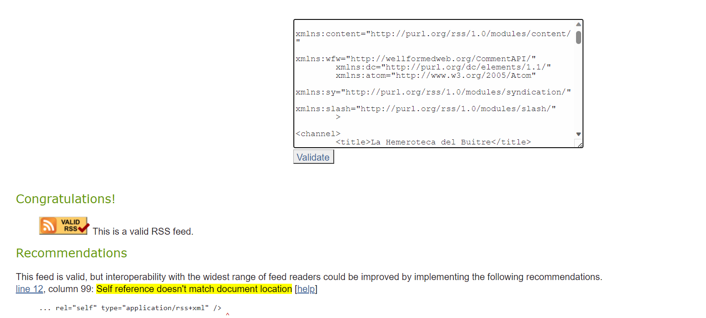
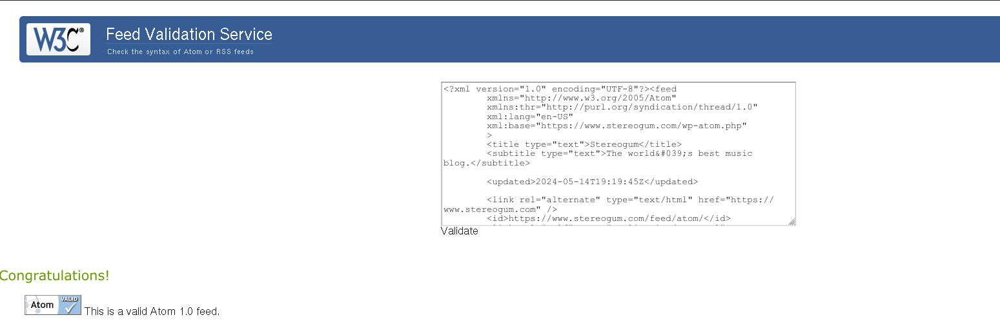
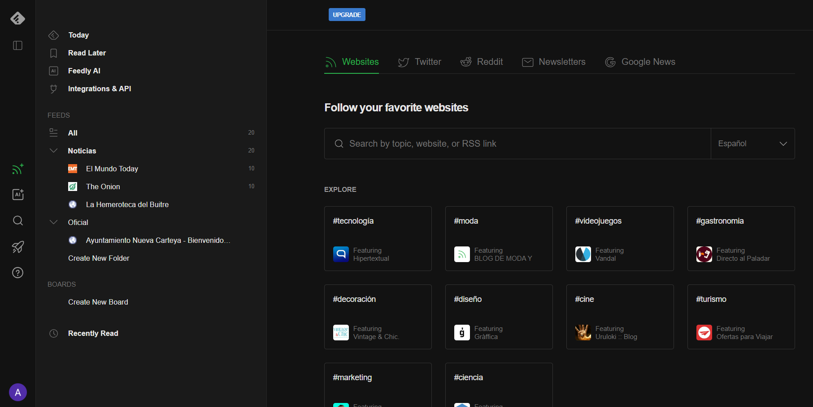

# Archivos RSS de tres fuentes de noticias:
[El Mundo Today](./rsc/elmundotoday_RSS.xml)

[The Onion News](./rsc/theonion_RSS.xml)

[La Hemeroteca del Buitre](./rsc/hemerotecabuitre_RSS.xml)

# Archivo RSS de una fuente oficial:

[Ayuntamiento de Carteya](./rsc/aytocarteya_RSS.xml)

# Archivo ATOM de una página web
[Stereogum](./rsc/stereogum_ATOM.xml)

# Validación de dos archivos RSS:

## Hemeroteca del Buitre

## Ayuntamiento de Nueva Carteya

# Validación de un archivo ATOM:

## Feedly

# Etiquetas Principales

Las etiquetas principales de los archivos RSS:

* Etiqueta 'rss'
* Etiqueta 'title'
* Etiqueta 'description'
* Etiqueta 'link'
* Etiqueta 'category'
